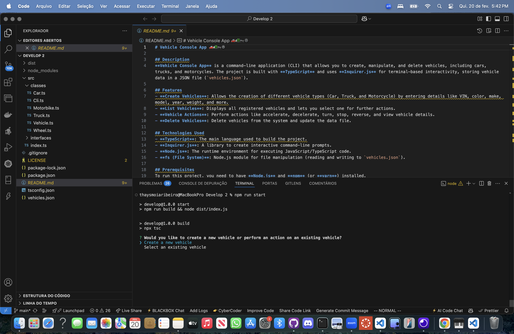

# Vehicle Console App 🚗🚛🏍️🛞

## Description

**Vehicle Console App** is a command-line application (CLI) that allows you to create, manipulate, and delete vehicles, including cars, trucks, and motorcycles. The project is built with **TypeScript** and uses **Inquirer.js** for terminal-based interactivity, storing vehicle data in a JSON file (`vehicles.json`).

## Features

- **Create Vehicles**: Allows the creation of different vehicle types (Car, Truck, and Motorcycle) by entering details like VIN, color, make, model, year, weight, and more.
- **List Vehicles**: Displays all registered vehicles and lets you select one for further actions.
- **Vehicle Actions**: Perform actions like accelerate, decelerate, turn, stop, reverse, and view vehicle details.
- **Delete Vehicles**: Delete vehicles from the system and update the data file.

## Technologies Used

- **TypeScript**: The main language used to build the project.
- **Inquirer.js**: A library to create interactive command-line prompts.
- **Node.js**: The runtime environment for executing JavaScript/TypeScript code.
- **fs (File System)**: Node.js module for file manipulation (reading and writing to `vehicles.json`).

## Prerequisites

To run this project, you need to have **Node.js** and **npm** (or **yarn**) installed.

### 🎥 Video Tutorial

<a href="https://www.loom.com/share/dc5c5fd971c84740b7eea59d98151ac3?sid=49943ffa-b5bd-4d88-b3bb-1fb059577c1a">
    
</a>

## How to Run

### 1. Clone the repository:

```bash
git clone https://github.com/ThayRibeiro0/vehicle-console-app.git
```

### 2. Clone the repository:

```bash
npm install
```

### 3. Run the application:

```bash
npm start
```

## Contributing

Contributions are welcome!

- Fork the repository.
- Create a new branch for your feature or bug fix.
- Make your changes and commit them with clear and descriptive commit messages.
- Push your changes to your forked repository.
- Create a pull request to the original repository.

## Authors

- [Thaysmoia Ribeiro](https://github.com/thaysmoiaribeiro)

## License

This project is licensed under the MIT License.

### References

- Bootcamp UCI - https://bootcamp.uci.edu/bootcamp/UCI-Bootcamp-2023/index.html
- TypeScript - https://www.typescriptlang.org/
- Inquirer.js - https://www.npmjs.com/package/inquirer
- Node.js - https://nodejs.org/en/
- fs (File System) - https://nodejs.org/api/fs.html 
- console - https://nodejs.org/api/console.html
- npm (Node Package Manager) - https://www.npmjs.com/
- Stack Overflow - https://stackoverflow.com/
- GitHub - https://github.com/
- YouTube - https://www.youtube.com/
- Google - https://www.google.com/
